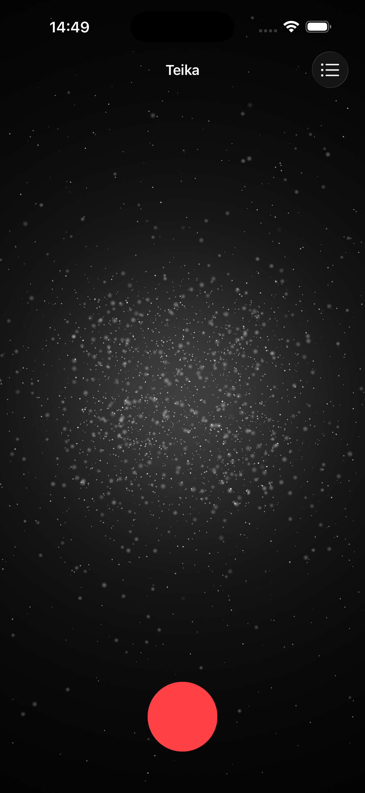
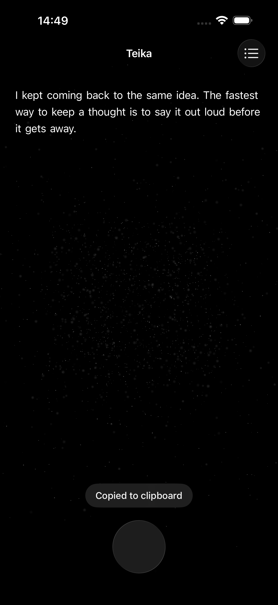
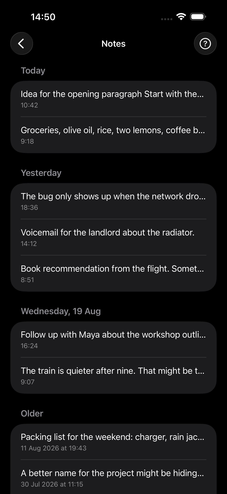

# Teika — catch the thought before it is gone

Teika is a free and open-source speech-to-text notes app for iPhone and Apple
Watch. Tap the circle, speak for as long as you need, then tap again. The
transcription is copied to your clipboard and saved in a searchable local
library.

## How it works

1. **Start from what is closest.** Open Teika from the app, Apple Watch, a
   widget, Control Center, Shortcuts or Siri.
2. **Talk until you are done.** Pausing to think does not end the recording.
3. **Paste it now or find it later.** Each transcription goes to the clipboard
   and the on-device notes library.

## Privacy

Speech recognition runs on the iPhone. Teika does not upload recordings,
transcripts or notes, and it has no account, subscription, ads or in-app
analytics. After you approve a one-time model download of about 0.5 GB from
Hugging Face, transcription works offline.

Apple Watch recordings are transferred to the paired iPhone through Apple's
WatchConnectivity service for local transcription. See the full
[privacy policy](PRIVACY.md) for details.

## Screenshots

| Record a thought | Review a captured note | Browse all notes |
| --- | --- | --- |
|  |  |  |

## Installation

[Download Teika from the App Store](https://apps.apple.com/app/id6796609245), or
build it from source.

### Requirements

- An iPhone or iPad running iOS 26.5 or later
- watchOS 26.0 or later for the companion Apple Watch app
- Xcode with the iOS 26.5 and watchOS 26 SDKs
- [XcodeGen](https://github.com/yonaskolb/XcodeGen)

### Run the app

`run.sh` generates the Xcode project, lets you choose an available simulator or
device, builds Teika and launches it:

```sh
./run.sh
```

You can also pass a destination directly:

```sh
./run.sh app "iPhone 17 Pro"
```

Simulator builds need no signing configuration. For a physical device, provide
your Apple Developer Team ID locally:

```sh
TEIKA_DEVELOPMENT_TEAM=YOUR_TEAM_ID ./run.sh app "Your iPhone"
```

### Run the tests

Generate the project, then select a simulator installed on your Mac:

```sh
xcodegen generate
xcodebuild test \
  -project Teika.xcodeproj \
  -scheme Teika \
  -destination 'platform=iOS Simulator,name=iPhone 17 Pro'
```

The live model-download UI test is skipped by default because it downloads about
0.5 GB. Set `RUN_MODEL_DOWNLOAD_TEST=YES` only when you intend to exercise it.

### Run the website

The marketing, support and privacy site is a static Next.js export in `site/`:

```sh
./run.sh site          # development server
./run.sh site build    # production export
./run.sh site preview  # build and serve the export
```

## Acknowledgements

- Speech recognition uses
  [NVIDIA Parakeet TDT 0.6B v3](https://huggingface.co/nvidia/parakeet-tdt-0.6b-v3)
  through [FluidAudio](https://github.com/FluidInference/FluidAudio).
- Debug controls use [DialKit](https://github.com/mikelikesdesign/dialkit-ios).
- Third-party license notices bundled with the app are in
  [`teika/LICENSES.txt`](teika/LICENSES.txt).

## License

Teika is licensed under the GNU General Public License v3.0 or later, with an
additional permission for distribution through the Apple App Store. See
[LICENSE](LICENSE).
